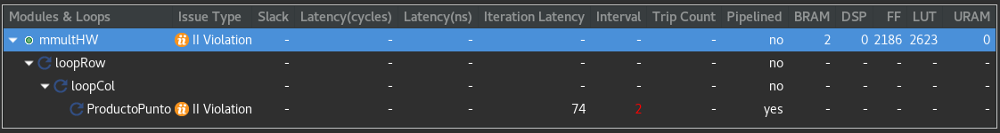
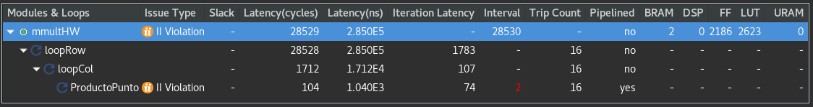

# Sección 1: Problemas con Código C Tradicional

En esta sección veremos que es lo que pasa cuando se trata de sintetizar un código que no fue pensado para HLS, particularmente se va a trabajar con un multiplicador de matrices que se encuentra [aquí](./srcHW/mmultHW.cpp). 


Tal cual como está el código, se puede correr el testbench exitosamente con tamaños diferentes. Al sintetizar se obtienen los siguientes resultados:



Se puede ver que no hay información con respecto a la latencia, esto se debe a que los limites de los ciclos for son variables. Para obtener información sobre latencia se puede ocupar el pragma [LOOP_TRIPCOUNT](https://www.xilinx.com/html_docs/xilinx2020_2/vitis_doc/hls_pragmas.html#sty1504034367099) para indicar manualmente el numero de iteraciones del ciclo. Este pragma es para análisis, no afecta el código sintetizado. 

```
void mmultHW (T *A, T *B, T *C, int m, int n, int p){

    loopRow:for (int row = 0; row < m; row++) {
#pragma HLS LOOP_TRIPCOUNT max=16
         loopCol:for (int col = 0; col < p; col++) {
#pragma HLS LOOP_TRIPCOUNT max=16
              T result = 0;
              ProductoPunto:for (int k = 0; k < n; k++) {
#pragma HLS LOOP_TRIPCOUNT max=16
                   result += A[row*n+k] * B[k*p+col];
              }
              C[row*p+col] = result;
         }
    }
}
```

Al sintetizar con estos pragmas se obtiene lo siguiente:



Ahora pasaremos a la siguiente [sección](../Seccion2/Seccion2.md) donde trabajaremos con matrices de tamaño fijo.

*Nota: Este código no pasa la co-simulación. Esto se puede deber a que el acceso a las matrices no es secuencial (particularmente B)*
