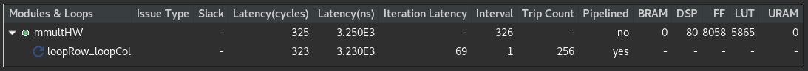
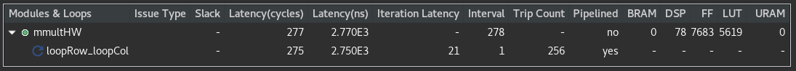
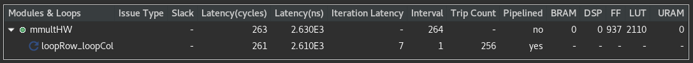

# Sección 2: Multiplicación de Matrices con tamaño fijo

En esta sección trabajaremos con multiplicación de matrices de tamaño fijo, 16x16 int, y veremos los efectos de diferentes pragmas. El código sin pragmas es el [siguiente](./srcHW/mmultHW.cpp):

```
void mmultHW (T A[M][N], T B[N][P], T C[M][P]){
    loopRow:for (int row = 0; row < M; row++) {
         loopCol:for (int col = 0; col < P; col++) {
              T result = 0;
              ProductoPunto:for (int k = 0; k < N; k++) {
                   result += A[row][k] * B[k][col];
              }
              C[row][col] = result;
         }
    }
}
```
Al sintetizarlo se obtienen los siguientes resultados:


Se obtiene una latencia menor que en la sección 1 y con más operaciones en paralelo.

---

## Unroll

Este código se puede mejorar si es que desenrollamos el ciclo for del producto punto (el último for) con el pragma [UNROLL](https://www.xilinx.com/html_docs/xilinx2020_2/vitis_doc/hls_pragmas.html#uyd1504034366571) de la siguiente manera:

```
void mmultHW (T A[M][N], T B[N][P], T C[M][P]){
    loopRow:for (int row = 0; row < M; row++) {
         loopCol:for (int col = 0; col < P; col++) {
              T result = 0;
              ProductoPunto:for (int k = 0; k < N; k++) {
#pragma HLS unroll
                   result += A[row][k] * B[k][col];
              }
              C[row][col] = result;
         }
    }
}
```
Se obtiene lo siguiente:


Baja aun más la latencia, pero el uso de recursos sube bastante. En el análisis se puede ver que se realizan aun más operaciones en paralelo que sin pragmas.

---

## Pipeline

Para hacer un pipeline basta con utilizar el pragma [PIPELINE](https://www.xilinx.com/html_docs/xilinx2020_2/vitis_doc/hls_pragmas.html#fde1504034360078) de la siguiente manera:

```
void mmultHW (T A[M][N], T B[N][P], T C[M][P]){
    loopRow:for (int row = 0; row < M; row++) {
         loopCol:for (int col = 0; col < P; col++) {
#pragma HLS pipeline 
              T result = 0;
              ProductoPunto:for (int k = 0; k < N; k++) {
#pragma HLS unroll
                   result += A[row][k] * B[k][col];
              }
              C[row][col] = result;
         }
    }
}
```

Se obtienen los siguientes resultados:


Al comparar los resultados con cuando no utilizamos pragmas se evidencia que estas son las mismas optimizaciones que hace Vitis HLS por defecto. 

Bajo *Issue Type* dice que hay una violación de intervalo, esto se debe a que no logró llegar al intervalo deseado (que por defecto es II=1), se puede cambiar el intervalo del pipeline agregando `II=<int>` al pragma.

Con `#pragma HLS pipeline II=10` se obtienen los siguientes resultados:


Ya no hay *Issue* y se puede ver que la latencia y el intervalo aumentaron. Para las siguientes secciones se dejará el intervalo por defecto, II=1.

---

## Array Partition

También se puede modificar como es el acceso a las memorias donde se guardan las matrices. En los ejemplos anteriores se utiliza una memoria tipo "dual port" (se puede ver bajo *HW Interfaces* en el reporte de síntesis), es decir se accede a dos elementos al mismo tiempo. Para esta aplicación seria ideal acceder a todos los elementos de cada fila para la matriz A y columna para B y C. Para lograr esto usaremos el pragma [ARRAY_PARTITION](https://www.xilinx.com/html_docs/xilinx2021_1/vitis_doc/hls_pragmas.html#gle1504034361378) de la siguiente manera: 

```
void mmultHW (T A[M][N], T B[N][P], T C[M][P]){
#pragma HLS ARRAY_PARTITION variable=A complete dim=2
#pragma HLS ARRAY_PARTITION variable=B complete dim=1
#pragma HLS ARRAY_PARTITION variable=C complete dim=1
    loopRow:for (int row = 0; row < M; row++) {
         loopCol:for (int col = 0; col < P; col++) {
#pragma HLS pipeline
              T result = 0;
              ProductoPunto:for (int k = 0; k < N; k++) {
#pragma HLS unroll
                   result += A[row][k] * B[k][col];
              }
              C[row][col] = result;
         }
    }
}
```

Se obtienen los siguientes resultados:


Con esto llegamos a una latencia solo un poco mejor que con solo UNROLL, pero con un uso de recursos un orden de magnitud menor. Bajo  *HW Interfaces* se puede ver que hay más memorias para cada matriz, 16 para cada una. También se puede observar un mayor paralelismo en la vista de análisis.

---
## Latencia

En algunos casos podria ser útil indicar la latencia que se quiere obtener, esto se hace con el pragma [LATENCY](https://www.xilinx.com/html_docs/xilinx2020_2/vitis_doc/hls_pragmas.html#rym1504034365159). No siempre es útil, ya que en este caso no se puede poner para indicar cuanta latencia para el módulo completo. El pragma se puede utilizar luego de el pragma PIPELINE para indicar la latencia de una iteración de este:

```
void mmultHW (T A[M][N], T B[N][P], T C[M][P]){
#pragma HLS ARRAY_PARTITION variable=A complete dim=2
#pragma HLS ARRAY_PARTITION variable=B complete dim=1
#pragma HLS ARRAY_PARTITION variable=C complete dim=1
    loopRow:for (int row = 0; row < M; row++) {
         loopCol:for (int col = 0; col < P; col++) {
#pragma HLS pipeline
#pragma HLS LATENCY min=16 max=50
              T result = 0;
              ProductoPunto:for (int k = 0; k < N; k++) {
#pragma HLS unroll
                   result += A[row][k] * B[k][col];
              }
              C[row][col] = result;
         }
    }
}
```
Se obtienen los siguientes resultados:


La latencia de 'loopRow_loopCol' ahora es de 17 y la latencia total aumentó a 273. Para las siguientes secciones no se va a utilizar este pragma.

---

## Punto Flotante

Con síntesis de alto nivel y con como está escrito el código es muy sencillo cambiar el tipo de dato con el que se está trabajando. En specs.h hay que cambiar la definición de `T` y ya se puede sintetizar el código.

```
#ifndef SPECS_H
#define SPECS_H

typedef float T;
#define M 16
#define N 16
#define P 16

#endif
```

Se obtienen los siguientes resultados:



Pareciera ser que esta latencia es aceptable, pero al observar la ventana de análisis nos encontramos que las sumas se están haciendo de forma secuencial. Esta síntesis es esperable ya que, con punto flotante, el orden de las operaciones cambia los resultados ligeramente y Vitis HLS por defecto los implementa para que den el mismo resultado que en CPU. 

Para implementar un adder tree con punto flotante hay dos alternativas, escribir un código C que sume los elementos de un vector de a pares o cambiar la configuración de Vitis para poder implementar un adder tree. Aqui utilizaremos la segunda opción.

En Solution Settings, bajo "config_compile" se encuentra la opción "unsafe_math_optimizations", activandola se realizaran optimizaciones que van a cambiar ligeramente los resultados en pos de optimizaciones de hardware.


Se obtienen los siguientes resultados:



Ahora en la ventana de análisis se puede ver claramente que todas las multiplicaciones se realizan en paralelo y también se ve claramente el adder tree (se ve mucho mas claro que con int).

---

## Punto Fijo

Para utilizar punto fijo se debe utilizar una biblioteca dada por Xilinx, basta con incluir [ap_fixed](https://www.xilinx.com/html_docs/xilinx2020_2/vitis_doc/vitis_hls_coding_styles.html#zej1585572412724). De la siguiente forma se obtiene un numero de 32 bits donde 12 son para la parte entera.

```
#ifndef SPECS_H
#define SPECS_H

#include <ap_fixed.h>
typedef ap_fixed<32,12,AP_RND > T;
#define M 16
#define N 16
#define P 16

#endif
```

Se obtienen los siguientes resultados:



Nótese que ya no se están ocupando DSPs. También se utilizan menos LUT y más FF que con *int*.

Ahora pasaremos a la siguiente [sección](../Seccion3/Readme.md) donde veremos como crear un proyecto con Vitis para multiplicar matrices en una FPGA.