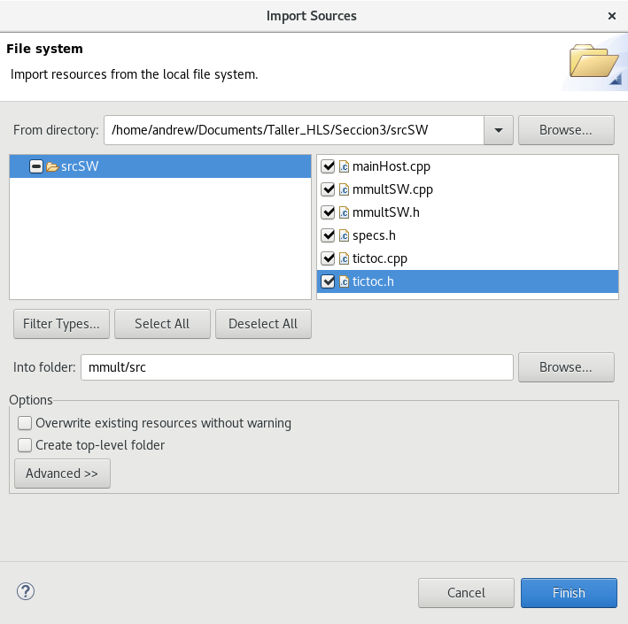

# Sección 3: Integración FPGA+CPU

En esta sección realizaremos multiplicaciones de matrices en FPGA y compararemos la velocidad con la de la implementación en CPU. Para esto descargaremos los archivos necesarios para trabajar con la tarjeta ZCU104, realizaremos cambios al código de la seccion anterior para que se pueda comunicar con la CPU y finalmente lo probaremos y mediremos el rendimiento.

## Preparación

* Descargar el archivo [ZCU104 Base 2020.2](https://www.xilinx.com/support/download/index.html/content/xilinx/en/downloadNav/embedded-platforms/archive-vitis-embedded.html)
* Descargar el archivo [ ZYNQMP common image](https://www.xilinx.com/support/download/index.html/content/xilinx/en/downloadNav/embedded-platforms/archive-vitis-embedded.html) y luego, en el directorio descargado, correr el siguiente comando `./sdk.sh -y -dir . -p`.

## Cambios al Código

El código que se trabajó en la [sección anterior](../Seccion2/Seccion2.md) se le agrega código para que guarde localmente las matrices A y B, de esta forma, cuando se necesiten leer los datos, estos ya están en la FPGA guardados en memorias con las características correspondientes.

## Exportar desde Vitis HLS

Se debe crear un proyecto en Vitis HLS con el código multiplicador de matrices de esta sección, una vez que se tenga listo (que pase simulación, cosimulación y se esté satisfecho con el uso de recursos) se debe exportar un archivo *.xo*. En *solution settings* >> *Export* >> *Format Selection* se debe escoger la opción *Vitis Kernel (.xo)* y luego exportar. 

## Crear un Proyecto en Vitis 2020.2

Al abrir Vitis (preferiblemente en un nuevo workspace), seleccionar *Create Application Project*. En *add* añadir el archivo *ZCU104 Base 2020.2*

Luego apretar *next* y en *Application project name* dar el nombre "mmult" (puede ser otro nombre pero no va a concordar con el resto del documento) y apretar *next.

En la ventana *Domain* se deben indicar los archivos que se crearon en la imagen común que se descargó. 
* En *Sysroot path*:  `<PATH_TO_COMMON_IMAGE>/xilinx-zynqmp-common-v2020.2/ir/sysroots/aarch64-xilinx-linux`
* En *Root FS*: `<PATH_TO_COMMON_IMAGE>/xilinx-zynqmp-common-v2020.2/rootfs.ext4`
* En *Kernel Image*: `<PATH_TO_COMMON_IMAGE>/xilinx-zynqmp-common-v2020.2/Image`

Apretar *next* y en la ventana *Template* seleccionar *Empty Application* (debajo de *SW acceleration templates*) y luego apretar *Finish*.

Con el projecto en blanco listo, ahora debemos agregar el código. Primero agregaremos el código que se va a ejecutar en el procesador de la siguiente manera:

En la ventana que se abre navegar a la *srcSW* y seleccionar todos los códigos.

Luego hay que importar el kernel que se creó en Vitis HLS:

El kernel exportado por Vitis HLS se debería encontrar en *solution1/impl/export.xo*.

En *mmult_kernels.prj*, seleccionar *Hardware* en *Active Build Configuration* y luego apretar *Add Hardware Function* como se muestra en la siguiente imagen:

Seleccionar *mmultHW()*.

## Características del código host

El código que se ejecuta en CPU llama a el kernel que se implementó en FPGA mediante OpenCL. Una breve explicación de que hace cada linea se encuentra [aquí](https://xilinx.github.io/Vitis-Tutorials/2020-1/docs/my-first-program/host_program.html) y un código de ejemplo [aquí](https://github.com/Xilinx/Vitis-Tutorials/blob/2021.1/Getting_Started/Vitis/example/src/host.cpp).

## Cambiar Frecuencia de Reloj

Si en Vitis HLS se utilizó una frecuencia de reloj distinta a 100MHz al momento de sintetizar el código, es necesario indicar a Vitis la frecuencia utilizada de la siguiente manera:

En *C/C++ Build Settings* de *mmult_system_hw_link* y *mmult_kernels* agregar el `flag --hls.clock <frecuencia>:<kernel>`. En este caso el flag es de 150MHz y para el kernel mmultHW: `flag --hls.clock 150000000:mmultHW`

El flag se agrega en la sección *miscellaneous*:

Y al apretar *Add* se puede escribir el flag:

## Pruebas en la ZCU104

*por terminar*
